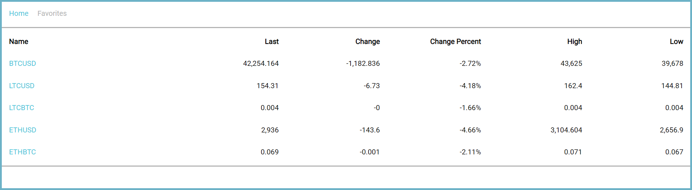

<h1>
Cryptocurrencies value tracker
</h1>

<h2>Project Overview</h2>

 
The web app tracks cryptocurrency prices and allows the user to favorite them and see them on a seperate favorites page. Upon clicking on the currency name, the user will see the latest price changes as well as have the option to add or remove it from favorites. If the user is not logged in they will not have the option to favorite the cryptocurrency.

 

<h2>Technologies</h2>

For this project, the following technologies were used:

<ul>
    <li>
HTML - Used to create the markup of the page.

    </li>
        <li>
SASS/CSS - Sass was used in order to streamline and simplify the styling of the page.

    </li>
        </li>
        <li>
ReactJS - This framework was useful to more easily create sections and components of the website.

    </li>
    <li>
React Router - React Router was used to dynamically create pages and for conditional page redirection.

    </li>
        <li>
Redux - Redux was used for storing application critical data separate from the UI, that was used for profile verification and creating app functionalities using it.

    </li>
        </li>
        <li>
Redux persist - Redux persist is a library that allows certain state values to be saved to local storage, therefore making the data available even upon refreshing the page.

</ul>
